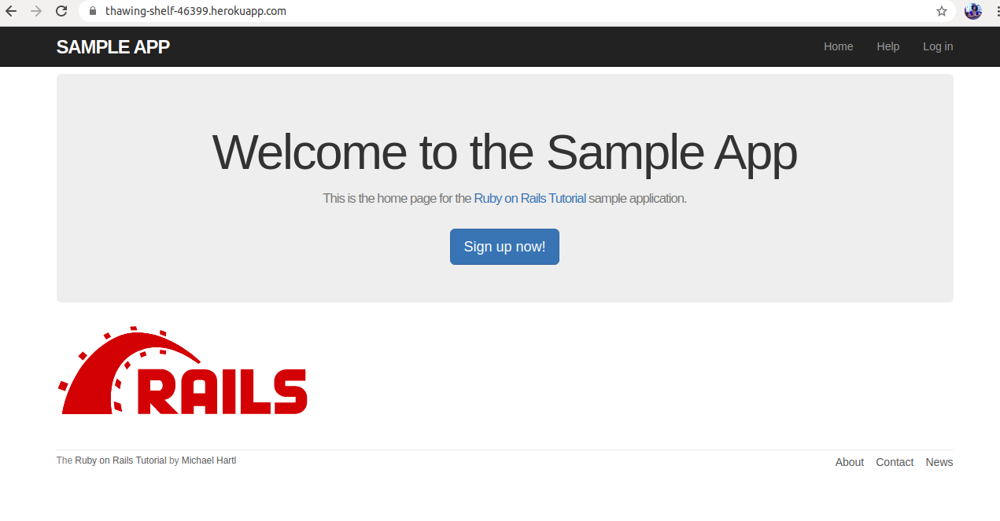

# Ruby on Rails Tutorial sample application

>  Sample App



The purpose is to get a high-level overview of Ruby on Rails programming(and web development in general)

## Built With

- Ruby language,
- Ruby on Rails framework,
- Vscode for coding
- Rubocop for Validation

## Live Demo

[Live Demo Link](https://whispering-falls-40634.herokuapp.com/)


# Ruby on Rails Tutorial sample application

This is the sample application for
[*Ruby on Rails Tutorial:
Learn Web Development with Rails*](https://www.railstutorial.org/)
by [Michael Hartl](http://www.michaelhartl.com/).

## License

All source code in the [Ruby on Rails Tutorial](https://www.railstutorial.org/)
is available jointly under the MIT License and the Beerware License. See
[LICENSE.md](LICENSE.md) for details.

## Getting started

To get started with the app, clone the repo and then install the needed gems:

```
$ bundle install --without production
```

Next, migrate the database:

```
$ rails db:migrate
```

Finally, run the test suite to verify that everything is working correctly:

```
$ rails test
```

If the test suite passes, you'll be ready to run the app in a local server:

```
$ rails server
```

For more information, see the
[*Ruby on Rails Tutorial* book](https://www.railstutorial.org/book).
## Authors

👤 **Selma Ndi**

- Github: [@githubhandle](https://github.com/Datagirlcmr)
- Twitter: [@twitterhandle](https://twitter.com/SelmaNdi)
- Linkedin: [linkedin](https://www.linkedin.com/in/selma-ndi-datagirl-imba-8976ab32/)

## 🤝 Contributing

Contributions, issues and feature requests are welcome!

Feel free to check the [issues page](https://github.com/Datagirlcmr/Toy-App/issues).

## Show your support

Give a ⭐️ if you like this project!

## Acknowledgments

- MicroverseInc(https://www.microverse.org/)
- Rails Tutorial(https://www.railstutorial.org/book/toy_app)


## 📝 License

This project is [MIT](lic.url) licensed.
